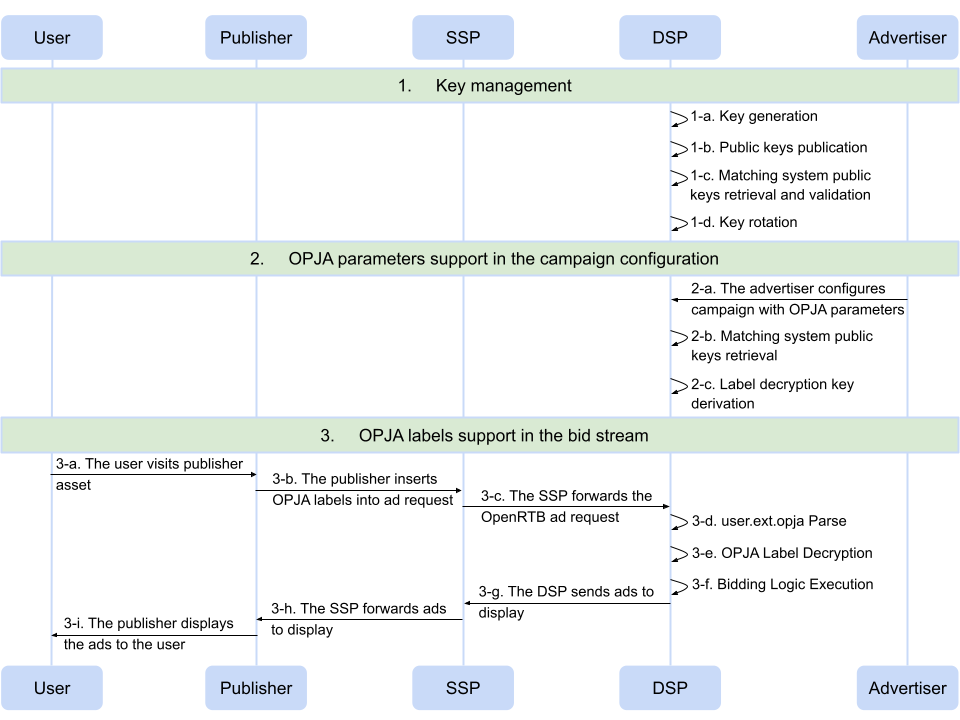

# OPJA DSP Integration Guide

This guide is for DSPs who want to support OPJA labels in their bid stream.

## Integration Steps

In order to support OPJA labels as part of the RTB protocol, there are three major steps that you, as a DSP, need to implement:

1. Key management

2. OPJA parameters support in the campaign configuration

3. OPJA labels support in the bid stream

Here is a high-level overview of the major steps involved in the DSP integration flow:

The following sections will provide additional details for each step in the diagram.

## 1. Key Management

Key management involves key generation, public keys publication, retrieval and validation of all configured matching systems' public keys, and key rotation. Each of these steps is described in detail below.

### 1-a. Key Generation

First, generate an X25519 private-public key pair. For that, you may use one of the available well-known and trusted cryptographic libraries (*e.g.,* [Go ecdh package](https://pkg.go.dev/crypto/ecdh)) to avoid any bugs, security issues, or misuse.

#### Sample Private Key

<pre>
 8c d1 93 8b 08 9e fd 79 d5 84 f2 45 31 f2 ef 5b
 c3 4c 1c 82 6b 59 0f 21 3c 33 b3 e5 d4 e3 60 c3
</pre>

#### Sample Public Key

<pre>
 36 f2 c9 c2 74 3d aa 19 1b 08 e2 9c 9d d8 33 48
 89 4b 1e 3a e5 13 f9 b3 f0 bf 23 fb 4f c9 52 4c
</pre>

### 1-b. Public Keys Publication

Next, publish your public keys using the [IAB Tech Lab Call Sign](https://iabtechlab.com/ads-cert/) protocol:

1. Encode the X25519 public key into a base64url string (43 characters long without padding).
   
   

   <pre>
    NvLJwnQ9qhkbCOKcndgzSIlLHjrlE_mz8L8j-0_JUkw
   </pre>
   

2. Create a root DNS record `_opjacert` under your registered “public suffix + 1” domain name with field `v` set to `opjapf` and field `a` set to the authority domain.
   
   

   <pre>
    <b>v=</b>opjapf   <b>a=</b>example-dsp.com
   </pre>
   

3. Create a `_delivery._opjacert` DNS record with field `v` set to the constant value `opjacrtd`, the field `k` set to the constant value `x25519`, and the field `p` set to your base64url-encoded X25519 public key.
   
   

   <pre>
    <b>v=</b>opjacrtd   <b>k=</b>x25519   <b>p=</b>NvLJwnQ9qhkbCOKcndgzSIlLHjrlE_mz8L8j-0_JUkw
   </pre>
   

   
   Note that, the DNS record can contain up to five public keys in the decreasing order of expiry, permitting key rotation (explained in step 1-d. below).

### 1-c. Public Keys Retrieval and Validation

For each configured (from 2-a. below) matching system, discover, validate, and store the latest OPJA public keys:

1. Retrieve the `_delivery._opjacert` DNS record from the configured (from 2-a. below) matching system's Call Sign domain.

2. Store all public keys published in the matching system's DNS record.

3. For each configured campaign, check if the public key of the matching system (stored in 2-a. below) is in the `_delivery._opjacert` DNS record. If not, invalidate the campaign.

It is recommended that you re-fetch and update all stored public keys frequently so that they are up to date.

### 1-d. Key Rotation

To limit the amount of time a private key is vulnerable, it is recommended that you rotate your key pairs at least once every 180 days:

1. Generate fresh X25519 private-public key pair (as explained in step 1-a. above).

2. Publish all public keys that are valid in the last 180 days, in the decreasing order of expiry (*i.e.*, the current key as the first key, the previous key as the second key, and so on), in the `_delivery._opjacert` DNS record. 
   
   Since the `_delivery._opjacert` DNS record can contain at most five public keys, it is recommended that you rotate public keys no more than five times in any 180 day period.

Note that campaigns involving match transactions associated with the public keys that are not published in the `_delivery._opjacert` DNS record will stop working altogether.

## 2. OPJA Parameters Support In The Campaign Configuration

In order to decrypt OPJA labels from the bid stream, you must: i) support OPJA parameters in your campaign configuration, ii) retrieve and validate all configured  matching systems' public keys, and iii) derive the label decryption key for the match transaction in a configured campaign. Each of these steps is described in detail below.

### 2-a. Campaign Configuration

The advertiser is responsible for configuring an ad campaign that targets an OPJA match transaction in their DSP. They'll input a .json file containing the information returned by their matching system, referred to as the OPJA parameters.

#### Sample Config File

<pre>
{
    <b>"matchingsystemname":</b> "match-system-operator.com",
    <b>"matchid":</b> "2VwhmTY9MecgWsu6",
    <b>"ekey":</b> "dee11f5918764a64cdb118f27b9e79c9831d2d092a31e3c40686485e7fc75d7c",
    <b>"mspk":</b> "RkBYP4wrRP10-gmeuzry-cCdTWISUYWevkGcFD4I33o",
    <b>"dsppk":</b> "NvLJwnQ9qhkbCOKcndgzSIlLHjrlE_mz8L8j-0_JUkw"
}
</pre>

You must add support to parse and store these OPJA parameters, explained in detail below.

- **Matching system's Call Sign domain ($matchingsystemname$):** A distinct Internet domain name (as published by publicsuffix.org) that has a root DNS record `_opjacert` under the "public suffix + 1" domain name.

- **Match transaction ID ($matchid$):** Up to 16 characters long unique identifier containing alphanumeric characters (*i.e.,* [a-zA-Z0-9]).

- **Encapsulated key ($ekey$):** A 32-byte encapsulation of an ephemeral symmetric key, used to derive the label decryption key for the specified match transaction.

- **Matching system public key ($mspk$):** The 32-byte X25519 public key of the matching system used to generate the $ekey$.

- **DSP public key ($dsppk$):** The 32-byte X25519 public key of the DSP used to generate the $ekey$.

### 2-b. Public Keys Retrieval

Once an advertiser configures a campaign with the OPJA parameters, you must discover, validate, and store the latest OPJA public keys of the configured (from 2-a.) matching system:

1. Retrieve the `_delivery._opjacert` DNS record from the configured matching system's Call Sign domain.
   
   

   <pre>
    <b>v=</b>opjacrtd   <b>k=</b>x25519   <b>p=</b>RkBYP4wrRP10-gmeuzry-cCdTWISUYWevkGcFD4I33o
   </pre>
   

2. Store all public keys published in the `_delivery._opjacert` DNS record.

3. Check if the specified public key, $mspk$, is in the `_delivery._opjacert` DNS record. If not, invalidate the campaign.

4. Check if the specified public key, $dsppk$, is in your `_delivery._opjacert` DNS record. If not, invalidate the campaign.

5. Store the parsed OPJA parameters for each campaign:
   
   

   <pre>
    <b>matchingsystemname:</b> match-system-operator.com
    <b>matchid:</b>            2VwhmTY9MecgWsu6
    <b>ekey:</b>               de e1 1f 59 18 76 4a 64 cd b1 18 f2 7b 9e 79 c9
                        83 1d 2d 09 2a 31 e3 c4 06 86 48 5e 7f c7 5d 7c
    <b>mspk:</b>               RkBYP4wrRP10-gmeuzry-cCdTWISUYWevkGcFD4I33o
    <b>dsppk:</b>              NvLJwnQ9qhkbCOKcndgzSIlLHjrlE_mz8L8j-0_JUkw
   </pre>
   

### 2-c. Label Decryption Key Derivation

For each configured campaign (in step 2-b. above), perform the following steps:

1. Check if the stored matching system's public key, $mspk$,  is in the current list of public keys (retrieved in step 1-c. above) for that matching system. If not, invalidate the campaign.

2. Check if the stored DSP public key, $dsppk$, is one of your currently valid public keys published in your `_delivery._opjacert` DNS record. If not, invalidate the campaign.

3. Using the following as inputs: i) your private key corresponding to $dsppk$,
   
   ii) $ekey$, and iii) $mspk$, perform decapsulation in Auth mode as described in 
   
   the HPKE standard [[RFC 9180](https://datatracker.ietf.org/doc/rfc9180/)]. This gives the ephemeral symmetric key.

4. Using the ephemeral symmetric key (output in step 3. above) and an optional sender info parameter as inputs to the HPKE key [[RFC 9180](https://datatracker.ietf.org/doc/rfc9180/)] schedule in Auth mode, derive the label decryption key $k$.

5. *Securely* store the label decryption key indexed by $matchingsystemname$ and $matchid$.
   
   

   <pre>
    <b>matchingsystemname:</b> match-system-operator.com
    <b>matchid:</b>            2VwhmTY9MecgWsu6
    <b>k:</b>                  32 e3 a3 f7 85 4d e1 cf 5e 15 ad c9 eb 71 05 a6
   </pre>
   

## 3. OPJA Labels Support In The Bid Stream

To support OPJA labels in your bid stream, you must: i) parse user.ext.opja extension, ii) decrypt OPJA labels, and iii) execute bidding logic. Each of these steps is described in detail below.

### 3-a. to 3-c.

**3-a.** User visits publisher asset

**3-b.** The publisher asset resolves match transaction IDs and associated encrypted labels to ad requests. It then generates the OpenRTB ad request user.ext.opja object and injects it in outgoing ad requests forwarded to its SSP(s).

**3-c.** The SSP simply forwards the ad requests to the DSP(s).

### 3-d. user.ext.opja Parse

You must add support to parse the [OPJA extension](https://github.com/InteractiveAdvertisingBureau/openrtb/blob/feature/adds-opja-extension/extensions/2.x_official_extensions/opja.md) OpenRTB object injected in the ad request.

#### Sample user.ext.opja Object

<pre>
{
    <b>"user":</b> {
        <b>"ext":</b> {
            <b>"opja":</b> [
                {
                    <b>"name":</b> "match-system-operator.com",
                    <b>"matches":</b> [
                        {
                            <b>"id":</b> "2VwhmTY9MecgWsu6",
                            <b>"el":</b> "WY84ZZEz0pq3Z1X6bFoMe4l7OfSbatsd02cSFmI=",
                        }    
                    ]
                }
            ]
        }
    }
}
</pre>

The fields are  explained in detail below.

- **Matching system's Call Sign domain (name):** A distinct Internet domain name (as published by publicsuffix.org) that has a root DNS record `_opjacert` under the "public suffix + 1" domain name.

- **Matches (matches):** An array of objects containing all encrypted match transactions.

- **Match transaction ID ($id$):** Up to 16 characters long unique identifier containing alphanumeric characters (*i.e.,* [a-zA-Z0-9]).

- **Encrypted OPJA label ($el$):** base64 encoded encrypted label (40 characters long with padding).

### 3-e. OPJA Label Decryption

To decrypt an OPJA label $el$, perform the following steps:

1. Check if $name$ and $id$, corresponding to $el$, are present in the label decryption key map (from step 2-c. above). If not, ignore the OPJA label.

2. Retrieve the corresponding label decryption key $k$.
   
   

   <pre>
    32 e3 a3 f7 85 4d e1 cf 5e 15 ad c9 eb 71 05 a6
   </pre>
   

3. base64 decode $el$ with padding to a 29-byte binary string.
   
   

   <pre>
    59 8f 38 65 91 33 d2 9a b7 67 55 fa 6c 5a 0c
    7b 89 7b 39 f4 9b 6a db 1d d3 67 12 16 62
   </pre>
   

4. Split the binary string into $nonce$ (first 12 bytes) and $ciphertext$ (the remaining 17 bytes).
   
   

   <pre>
    <b>nonce:</b>      59 8f 38 65 91 33 d2 9a b7 67 55 fa
    <b>ciphertext:</b> 6c 5a 0c 7b 89 7b 39 f4 9b 6a db 1d d3 67 12 16 62
   </pre>
   

5. Decrypt the $ciphertext$ using AES-128-GCM, with key $k$ and $id$ as the associated data:
   
   `label = AES128_GCM_DECRYPT(k, nonce, ciphertext, id)`
   
   If the decryption fails, ignore the OPJA label.

### 3-f. Bidding Logic Execution

Interpret the recovered label (from step 3-e. above) as follows and execute the bidding logic.

- If $label$ = 0xff, the end user is in the overlap.

- If $label$ = 0x00, the end user is not in the overlap.

### 3-g. to 3-i.

**3-g.** Forward the ad to be displayed, to the SSP(s).

**3-h.** The SSP then simply forwards the ad to the publisher.

**3-i.** Finally, the publisher displays the ad to the user.

## Sample Implementation

A prototype implementation in Go can be found inside `guides/implementations/go`. The `opjale` library is a wrapper around the [Cloudflare CIRCL](https://github.com/cloudflare/circl) library, the standard implementation of HPKE in Go. It is created to enable DSPs to experiment with basic OPJA activation functionality such as generating OPJA key pairs and decrypting OPJA labels from specified matching system(s). The package `main` inside `opjale` provides a simplified end-to-end flow of the OPJA activation functionality. Note that this is a reference implementation and is not vetted for a *production* environment.
